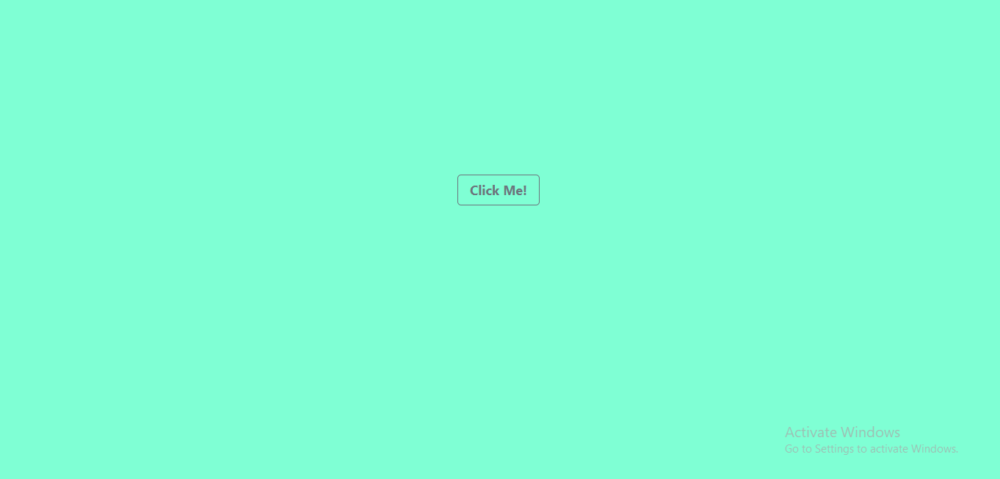

# Random-Color
*An implementation of Random-Color-project clone with html css and javascript*
## Prequisite
- Your browser version should be up to date for better experience
## Getting Started
Clone or download this repository and run with a local server of open `index.html` with your favorite browser
## Features
- Home page
## Tech/framework used
- Html
- Css
## Demo
[Go Live](https://eclectic-maamoul-1c3f34.netlify.app)

## Contact
If you want to contact me you can reach me at
- https://github.com/Intelligence247 or
- uthmanabdullahi2020@gmail.com
## Addtional Info
- This is one of the series of project for the @CodeVillage.org 
- This is not meant for production. It's for learning purpose only

